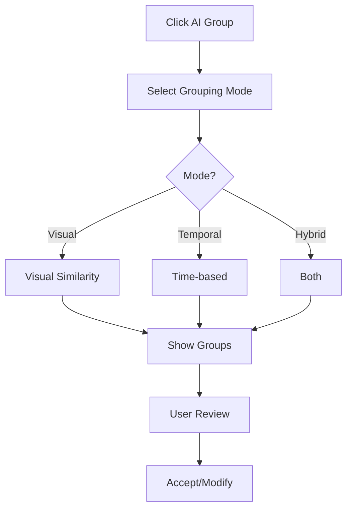
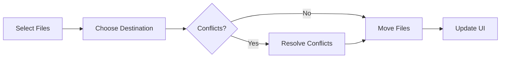

# Feature Specification Document
# PhotoSort Desktop Application

**Version:** 1.0  
**Date:** February 2, 2026  
**Status:** Draft

---

## Table of Contents

1. [Feature Overview](#1-feature-overview)
2. [File Scanning & Preview](#2-file-scanning--preview)
3. [AI-Powered Grouping](#3-ai-powered-grouping)
4. [Manual Sorting Workflows](#4-manual-sorting-workflows)
5. [Keyboard Shortcuts](#5-keyboard-shortcuts)
6. [Folder Management](#6-folder-management)
7. [File Operations](#7-file-operations)
8. [Settings & Configuration](#8-settings--configuration)
9. [Project Management](#9-project-management)
10. [User Workflows](#10-user-workflows)

---

## 1. Feature Overview

PhotoSort menyediakan dua pendekatan utama untuk sorting files:

### Approach A: Manual-First
1. User scan folder
2. User create folders manually
3. User assign shortcuts
4. User sort files dengan shortcuts atau drag-drop

### Approach B: AI-First
1. User scan folder
2. AI auto-group files
3. System create folders otomatis
4. User rename folders dan finalize

**Recommendation:** Support both approaches, let user choose their preferred workflow.

---

## 2. File Scanning & Preview

### 2.1 Folder Selection

#### User Story
> As a user, I want to select a folder containing my files so that I can start organizing them.

#### Workflow


#### UI Components
- **Button:** "Scan Folder" dengan icon 📁
- **Shortcut:** `Ctrl+O`
- **Dialog:** Native Windows file dialog
- **Progress:** Progress bar dengan file count

#### Acceptance Criteria
- ✅ File dialog shows all folders
- ✅ Can select folder with up to 10,000 files
- ✅ Warning if > 3,000 files detected
- ✅ Cancel button to abort scanning

---

### 2.2 File Type Filtering

#### User Story
> As a user, I want to filter files by type so that I only see relevant files.

#### UI Components
```
┌─────────────────────────────────────┐
│ Filter by Type:                     │
│ ☑ Photos    ☑ Videos    ☑ Audio    │
│ ☑ Software  ☑ Documents ☑ Code     │
│ ☐ Show All                          │
└─────────────────────────────────────┘
```

#### Features
- **Checkboxes:** Toggle file types on/off
- **Show All:** Quick toggle untuk semua types
- **Count:** Show file count per type
- **Persistence:** Remember last filter settings

#### Acceptance Criteria
- ✅ Filter updates in real-time
- ✅ Shows count for each category
- ✅ Settings persist across sessions

---

### 2.3 File Preview Grid

#### User Story
> As a user, I want to see thumbnails of my files so that I can quickly identify them.

#### Layout Options

**Grid View (Default)**
```
┌────┬────┬────┬────┬────┐
│ 📷 │ 📷 │ 📷 │ 📷 │ 📷 │
│ 01 │ 02 │ 03 │ 04 │ 05 │
├────┼────┼────┼────┼────┤
│ 📷 │ 📷 │ 📷 │ 📷 │ 📷 │
│ 06 │ 07 │ 08 │ 09 │ 10 │
└────┴────┴────┴────┴────┘
```

**List View**
```
┌─────────────────────────────────────┐
│ 📷 image001.jpg    2.3 MB  Jan 15   │
│ 📷 image002.jpg    1.8 MB  Jan 15   │
│ 📷 image003.jpg    2.1 MB  Jan 16   │
└─────────────────────────────────────┘
```

#### Features
- **Virtual Scrolling:** Smooth performance dengan ribuan files
- **Thumbnail Size:** Adjustable (Small, Medium, Large)
- **Selection:** Multi-select dengan Ctrl/Shift
- **Hover:** Show filename dan metadata on hover
- **Right-click:** Context menu untuk quick actions

#### Metadata Display
- File name
- File size
- Date created/modified
- Resolution (untuk images)
- Duration (untuk videos)
- Group indicator (jika sudah di-group)

#### Acceptance Criteria
- ✅ Smooth 60fps scrolling
- ✅ Thumbnails load progressively
- ✅ Multi-select works correctly
- ✅ Context menu shows relevant actions

---

### 2.4 File Preview Panel

#### User Story
> As a user, I want to preview a file in full size so that I can verify its content before sorting.

#### Trigger
- Press `Space` on selected file
- Double-click file
- Click preview icon

#### Preview Types

**Images**
- Full resolution preview
- Zoom in/out
- Pan support
- EXIF data display

**Videos**
- Video player dengan controls
- Seek bar
- Volume control
- Duration display

**Audio**
- Audio player
- Waveform visualization (optional)
- Metadata (artist, album, etc.)

**Documents**
- Basic preview (if possible)
- Or show detailed metadata

#### UI Layout
```
┌─────────────────────────────────────┐
│  ← Back          image001.jpg    ✕  │
├─────────────────────────────────────┤
│                                     │
│                                     │
│           [Preview Image]           │
│                                     │
│                                     │
├─────────────────────────────────────┤
│ Size: 2.3 MB | 1920x1080 | Jan 15  │
│ Camera: Canon EOS 5D | ISO 400      │
└─────────────────────────────────────┘
```

#### Shortcuts
- `Space` - Toggle preview
- `Esc` - Close preview
- `Arrow Left/Right` - Previous/Next file
- `+/-` - Zoom in/out (images)

#### Acceptance Criteria
- ✅ Preview loads in < 1 second
- ✅ Supports all file types
- ✅ Keyboard navigation works
- ✅ Shows relevant metadata

---

## 3. AI-Powered Grouping

### 3.1 Visual Similarity Detection

#### User Story
> As a user, I want the AI to automatically group similar-looking photos so that I don't have to manually identify them.

#### Algorithm: Perceptual Hashing

**How it works:**
1. Generate pHash untuk setiap image
2. Calculate Hamming distance between hashes
3. Group images dengan distance < threshold
4. Create groups dengan minimum size

**Example:**
```
Screenshot_001.png  ─┐
Screenshot_002.png  ├─ Group 1: "Movie A" (15 files)
Screenshot_003.png  ─┘
...

Screenshot_016.png  ─┐
Screenshot_017.png  ├─ Group 2: "Movie B" (12 files)
Screenshot_018.png  ─┘
```

#### UI Flow


#### Settings
```
┌─────────────────────────────────────┐
│ Visual Similarity Settings          │
├─────────────────────────────────────┤
│ Similarity Threshold: [====|---] 80%│
│                                     │
│ Minimum Group Size: [3] files       │
│                                     │
│ File Types:                         │
│ ☑ Photos  ☑ Videos  ☐ All          │
│                                     │
│ [Preview] [Apply] [Cancel]          │
└─────────────────────────────────────┘
```

#### Preview Mode
- Show sample dari each group
- Display similarity score
- Allow threshold adjustment dengan real-time update

#### Acceptance Criteria
- ✅ Accuracy > 80% untuk screenshot dari film yang sama
- ✅ Processing time < 30s untuk 3000 images
- ✅ User dapat adjust threshold
- ✅ Preview shows representative samples

---

### 3.2 Temporal Grouping

#### User Story
> As a user, I want to group files by date/time so that I can organize files from the same session.

#### Time Range Options
- **Same Hour:** Files dalam 1 jam yang sama
- **Same Day:** Files dalam 1 hari yang sama (default)
- **Same Week:** Files dalam 1 minggu yang sama
- **Custom Range:** User-defined (contoh: 2 hours, 3 days)

#### Example
```
Group 1: Jan 15, 2026 (Morning)
├─ 08:15 - photo001.jpg
├─ 08:17 - photo002.jpg
└─ 08:20 - photo003.jpg

Group 2: Jan 15, 2026 (Afternoon)
├─ 14:30 - photo004.jpg
├─ 14:35 - photo005.jpg
└─ 14:40 - photo006.jpg
```

#### UI Settings
```
┌─────────────────────────────────────┐
│ Temporal Grouping Settings          │
├─────────────────────────────────────┤
│ Time Range:                         │
│ ○ Same Hour                         │
│ ● Same Day                          │
│ ○ Same Week                         │
│ ○ Custom: [2] Hours                 │
│                                     │
│ Date Source:                        │
│ ● EXIF Date (if available)          │
│ ○ File Creation Date                │
│ ○ File Modified Date                │
│                                     │
│ [Preview] [Apply] [Cancel]          │
└─────────────────────────────────────┘
```

#### Acceptance Criteria
- ✅ Correctly parse EXIF dates
- ✅ Fallback to file dates if no EXIF
- ✅ Handle timezone correctly
- ✅ Groups are chronologically ordered

---

### 3.3 Hybrid Grouping

#### User Story
> As a user, I want the AI to combine visual and temporal analysis for the most accurate grouping.

#### Algorithm
```
1. First Pass: Group by time range
   └─ Creates temporal groups

2. Second Pass: Within each temporal group, apply visual similarity
   └─ Splits temporal groups by visual similarity

3. Result: Groups that are both temporally and visually similar
```

#### Example
```
Jan 15, 2026 (Morning) - Movie A Screenshots
├─ 08:15 - screenshot_001.png  ─┐
├─ 08:16 - screenshot_002.png  ├─ Visually similar
└─ 08:17 - screenshot_003.png  ─┘

Jan 15, 2026 (Morning) - Movie B Screenshots
├─ 08:20 - screenshot_004.png  ─┐
├─ 08:21 - screenshot_005.png  ├─ Visually similar
└─ 08:22 - screenshot_006.png  ─┘
```

#### Benefits
- More accurate than single method
- Handles edge cases (same time, different content)
- Reduces false positives

#### Acceptance Criteria
- ✅ Combines both methods correctly
- ✅ Better accuracy than single method
- ✅ Processing time < 45s untuk 3000 files

---

### 3.4 Group Review & Editing

#### User Story
> As a user, I want to review and modify AI-generated groups before finalizing them.

#### UI Layout
```
┌─────────────────────────────────────────────────────────┐
│ AI Grouping Results - 2,847 files in 12 groups          │
├─────────────────────────────────────────────────────────┤
│ ┌─────────────────────────────────────────────────────┐ │
│ │ Group 1: "Movie A Screenshots" (245 files)          │ │
│ │ [📷 📷 📷 📷 📷] ... [Expand]                        │ │
│ │ Similarity: 92% | Jan 15, 08:00-09:30               │ │
│ │ [Rename] [Split] [Merge] [Delete]                   │ │
│ └─────────────────────────────────────────────────────┘ │
│                                                           │
│ ┌─────────────────────────────────────────────────────┐ │
│ │ Group 2: "Movie B Screenshots" (198 files)          │ │
│ │ [📷 📷 📷 📷 📷] ... [Expand]                        │ │
│ │ Similarity: 88% | Jan 15, 14:00-15:45               │ │
│ │ [Rename] [Split] [Merge] [Delete]                   │ │
│ └─────────────────────────────────────────────────────┘ │
├─────────────────────────────────────────────────────────┤
│ [Accept All] [Create Folders] [Adjust Settings] [Cancel]│
└─────────────────────────────────────────────────────────┘
```

#### Actions

**Rename Group**
- Inline editing
- Becomes folder name if accepted

**Split Group**
- Manual split into sub-groups
- Drag files between groups

**Merge Groups**
- Select multiple groups
- Merge into single group

**Delete Group**
- Remove group (files become ungrouped)

**Expand Group**
- Show all files in group
- Grid view dengan selection

#### Workflow Options

**Option 1: Create Folders Immediately**
- Click "Create Folders"
- System creates folder untuk each group
- Files ready to be moved

**Option 2: Rename First, Then Create**
- Rename all groups
- Click "Accept All"
- System creates folders dengan renamed names

#### Acceptance Criteria
- ✅ Can rename groups inline
- ✅ Can split/merge groups
- ✅ Changes update in real-time
- ✅ Can undo group modifications

---

## 4. Manual Sorting Workflows

### 4.1 Workflow A: Pre-Create Folders

#### User Story
> As a user, I want to create folders first and then assign shortcuts so that I can quickly sort files.

#### Step-by-Step

**Step 1: Create Folders**
```
1. Click "New Folder" atau Ctrl+N
2. Enter folder name (e.g., "Movie A")
3. Folder created dengan auto-assigned shortcut (1-9)
4. Repeat untuk folders lainnya
```

**Step 2: Customize Shortcuts (Optional)**
```
1. Right-click folder
2. Select "Edit Shortcut"
3. Press new key combination
4. Shortcut updated
```

**Step 3: Sort Files**
```
1. Select file(s)
2. Press shortcut key (e.g., "1" untuk Movie A)
3. Files moved instantly
4. Repeat
```

#### UI Components
```
┌─────────────────────────────────────┐
│ Folders                             │
├─────────────────────────────────────┤
│ 📁 Movie A          [1] (0 files)   │
│ 📁 Movie B          [2] (0 files)   │
│ 📁 Movie C          [3] (0 files)   │
│ 📁 Misc             [9] (0 files)   │
│                                     │
│ [+ New Folder]                      │
└─────────────────────────────────────┘
```

#### Acceptance Criteria
- ✅ Can create up to 50 folders
- ✅ Shortcuts 1-9 auto-assigned
- ✅ Can customize any shortcut
- ✅ Folder count updates in real-time

---

### 4.2 Workflow B: AI-First, Then Rename

#### User Story
> As a user, I want the AI to create groups first so that I only need to rename them.

#### Step-by-Step

**Step 1: AI Grouping**
```
1. Click "AI Group" atau Ctrl+G
2. Wait for AI processing
3. Review generated groups
```

**Step 2: Rename Groups**
```
1. Click group name atau press F2
2. Enter new name
3. Press Enter to confirm
4. Repeat untuk all groups
```

**Step 3: Create Folders**
```
1. Click "Create Folders"
2. System creates folders dengan group names
3. Files automatically assigned to folders
```

**Step 4: Finalize**
```
1. Review folder assignments
2. Make manual adjustments if needed
3. Click "Save" to finalize
```

#### UI Flow


#### Acceptance Criteria
- ✅ AI creates meaningful default names
- ✅ Renaming is quick (inline editing)
- ✅ Folder creation is instant
- ✅ Can still make manual adjustments

---

### 4.3 Drag & Drop Sorting

#### User Story
> As a user, I want to drag files to folders so that I have visual control over sorting.

#### Features

**Drag Source:** File grid/list
**Drop Target:** Folder sidebar

**Visual Feedback:**
- Dragging file shows ghost image
- Drop target highlights on hover
- Show file count being moved

**Multi-Select Drag:**
- Select multiple files
- Drag any selected file
- All selected files move together

#### UI States
```
Normal State:
┌─────────────┐
│ 📁 Movie A  │
└─────────────┘

Hover State (Drag Over):
┌─────────────┐
│ 📁 Movie A  │ ← Highlighted
└─────────────┘

Drop State:
┌─────────────┐
│ 📁 Movie A  │ ← Flash animation
│ +5 files    │
└─────────────┘
```

#### Acceptance Criteria
- ✅ Smooth drag animation
- ✅ Clear drop target indication
- ✅ Multi-select drag works
- ✅ Undo drag operation

---

## 5. Keyboard Shortcuts

### 5.1 Default Shortcuts

#### Navigation
| Shortcut | Action |
|----------|--------|
| `Arrow Up/Down/Left/Right` | Navigate files |
| `Home` | First file |
| `End` | Last file |
| `Page Up/Down` | Scroll page |

#### Selection
| Shortcut | Action |
|----------|--------|
| `Ctrl+A` | Select all |
| `Ctrl+D` | Deselect all |
| `Ctrl+Click` | Toggle selection |
| `Shift+Click` | Range selection |
| `Ctrl+I` | Invert selection |

#### File Operations
| Shortcut | Action |
|----------|--------|
| `1-9` | Move to folder 1-9 |
| `Delete` | Delete selected files |
| `Ctrl+X` | Cut files |
| `Ctrl+C` | Copy files |
| `Ctrl+V` | Paste files |
| `F2` | Rename file |

#### Folder Operations
| Shortcut | Action |
|----------|--------|
| `Ctrl+N` | New folder |
| `Ctrl+R` | Rename folder |
| `Ctrl+Shift+N` | New folder with shortcut |

#### View
| Shortcut | Action |
|----------|--------|
| `Space` | Preview file |
| `Esc` | Close preview |
| `Ctrl+1` | Grid view |
| `Ctrl+2` | List view |
| `Ctrl++` | Increase thumbnail size |
| `Ctrl+-` | Decrease thumbnail size |

#### Application
| Shortcut | Action |
|----------|--------|
| `Ctrl+O` | Open/Scan folder |
| `Ctrl+S` | Save project |
| `Ctrl+G` | AI Group |
| `Ctrl+Z` | Undo |
| `Ctrl+Y` | Redo |
| `Ctrl+,` | Settings |
| `F1` | Help |

---

### 5.2 Custom Shortcuts

#### User Story
> As a user, I want to customize shortcuts so that they match my workflow.

#### UI - Shortcut Editor
```
┌─────────────────────────────────────────────────────────┐
│ Keyboard Shortcuts                                      │
├─────────────────────────────────────────────────────────┤
│ Action                    Shortcut         [Edit]       │
├─────────────────────────────────────────────────────────┤
│ Open Folder              Ctrl+O           [Edit]        │
│ AI Group                 Ctrl+G           [Edit]        │
│ New Folder               Ctrl+N           [Edit]        │
│ Save Project             Ctrl+S           [Edit]        │
│ ...                                                     │
├─────────────────────────────────────────────────────────┤
│ [Reset to Default] [Import] [Export] [Save] [Cancel]   │
└─────────────────────────────────────────────────────────┘
```

#### Edit Flow
```
1. Click [Edit] button
2. Dialog shows: "Press new shortcut..."
3. User presses key combination
4. System checks for conflicts
5. If conflict: Show warning, allow override
6. If no conflict: Save new shortcut
```

#### Conflict Detection
```
⚠️ Conflict Detected

Ctrl+G is already assigned to "AI Group"

Do you want to:
○ Replace existing shortcut
○ Choose different shortcut
○ Cancel

[OK] [Cancel]
```

#### Acceptance Criteria
- ✅ All shortcuts customizable
- ✅ Conflict detection works
- ✅ Can reset to defaults
- ✅ Changes apply immediately

---

### 5.3 Shortcut Profiles

#### User Story
> As a user, I want to save and load shortcut profiles so that I can switch between different workflows.

#### Features

**Save Profile**
```
1. Customize shortcuts
2. Click "Export"
3. Enter profile name
4. Save as .json file
```

**Load Profile**
```
1. Click "Import"
2. Select .json file
3. Confirm import
4. Shortcuts applied
```

**Built-in Profiles**
- **Default:** Standard shortcuts
- **Vim-style:** hjkl navigation
- **Photoshop-style:** Similar to Adobe shortcuts

#### UI
```
┌─────────────────────────────────────┐
│ Shortcut Profiles                   │
├─────────────────────────────────────┤
│ ● Default                           │
│ ○ Vim-style                         │
│ ○ Photoshop-style                   │
│ ○ My Custom Profile                 │
│                                     │
│ [New] [Edit] [Delete] [Import]     │
└─────────────────────────────────────┘
```

#### Acceptance Criteria
- ✅ Can save/load profiles
- ✅ Built-in profiles available
- ✅ Profile switching is instant
- ✅ Profiles stored in user folder

---

## 6. Folder Management

### 6.1 Create Folder

#### UI - Quick Create
```
Click [+ New Folder] →

┌─────────────────────────────────────┐
│ New Folder                          │
├─────────────────────────────────────┤
│ Name: [Movie A____________]         │
│                                     │
│ Shortcut: [1] (auto-assigned)       │
│                                     │
│ Color: [🔴 🟢 🔵 🟡 ⚪] (optional) │
│                                     │
│ [Create] [Cancel]                   │
└─────────────────────────────────────┘
```

#### Validation
- ❌ Empty name
- ❌ Duplicate name
- ❌ Invalid characters (`/\:*?"<>|`)
- ❌ Name too long (> 255 chars)

#### Acceptance Criteria
- ✅ Folder created instantly
- ✅ Auto-assigned shortcut (1-9)
- ✅ Validation prevents errors
- ✅ Appears in sidebar immediately

---

### 6.2 Rename Folder

#### Methods
1. **Inline:** Click folder name, edit, press Enter
2. **Shortcut:** Select folder, press F2
3. **Context Menu:** Right-click → Rename

#### UI - Inline Editing
```
Before:
📁 Movie A [1]

During Edit:
📁 [Movie A - Director's Cut____] [1]
   ↑ Text input with current name

After:
📁 Movie A - Director's Cut [1]
```

#### Acceptance Criteria
- ✅ Inline editing works smoothly
- ✅ Validation same as create
- ✅ Shortcut preserved
- ✅ Files remain associated

---

### 6.3 Delete Folder

#### Confirmation Dialog
```
┌─────────────────────────────────────┐
│ ⚠️ Delete Folder?                   │
├─────────────────────────────────────┤
│ Folder: Movie A                     │
│ Contains: 245 files                 │
│                                     │
│ What should happen to the files?    │
│ ○ Move files to Recycle Bin         │
│ ● Keep files (unassign from folder) │
│                                     │
│ [Delete Folder] [Cancel]            │
└─────────────────────────────────────┘
```

#### Options
1. **Delete folder + files:** Files go to recycle bin
2. **Delete folder only:** Files become unassigned

#### Acceptance Criteria
- ✅ Confirmation required
- ✅ Shows file count
- ✅ User chooses file fate
- ✅ Can undo deletion

---

### 6.4 Folder Statistics

#### Display
```
┌─────────────────────────────────────┐
│ 📁 Movie A                     [1]  │
├─────────────────────────────────────┤
│ Files: 245                          │
│ Size: 1.2 GB                        │
│ Types: 245 photos                   │
│ Date Range: Jan 15-16, 2026         │
└─────────────────────────────────────┘
```

#### Real-time Updates
- File count updates as files added/removed
- Size recalculated automatically
- Type breakdown updated

#### Acceptance Criteria
- ✅ Statistics accurate
- ✅ Updates in real-time
- ✅ Performance not affected

---

## 7. File Operations

### 7.1 Move Files

#### Trigger Methods
1. Press shortcut key (1-9)
2. Drag & drop to folder
3. Right-click → Move to → Select folder

#### Process


#### Conflict Resolution
```
┌─────────────────────────────────────┐
│ ⚠️ File Already Exists              │
├─────────────────────────────────────┤
│ image001.jpg already exists in      │
│ destination folder.                 │
│                                     │
│ What do you want to do?             │
│ ○ Replace existing file             │
│ ○ Keep both (rename new file)       │
│ ○ Skip this file                    │
│                                     │
│ ☑ Apply to all conflicts            │
│                                     │
│ [OK] [Cancel]                       │
└─────────────────────────────────────┘
```

#### Progress Indicator
```
Moving 245 files to "Movie A"...
[████████████████░░░░] 80% (196/245)
Estimated time: 5 seconds

[Cancel]
```

#### Acceptance Criteria
- ✅ Move is atomic (all or nothing)
- ✅ Conflict resolution works
- ✅ Progress shown for > 10 files
- ✅ Can cancel operation

---

### 7.2 Copy Files

#### User Story
> As a user, I want to copy files instead of moving them so that I can keep the originals.

#### Trigger
- Hold `Ctrl` while dragging
- Right-click → Copy to → Select folder
- Shortcut: `Ctrl+Shift+1-9`

#### Same as Move, but:
- Files remain in source
- Duplicates created in destination
- Progress shows "Copying" instead of "Moving"

---

### 7.3 Delete Files

#### Confirmation
```
┌─────────────────────────────────────┐
│ ⚠️ Delete Files?                    │
├─────────────────────────────────────┤
│ You are about to delete 5 files.    │
│                                     │
│ Files will be moved to Recycle Bin  │
│ and can be restored later.          │
│                                     │
│ ☐ Don't ask again for this session  │
│                                     │
│ [Delete] [Cancel]                   │
└─────────────────────────────────────┘
```

#### Safety Features
- Move to Recycle Bin (not permanent)
- Confirmation dialog
- Undo capability
- "Don't ask again" option for batch deletes

#### Acceptance Criteria
- ✅ Files go to Recycle Bin
- ✅ Confirmation shown
- ✅ Can undo delete
- ✅ Batch delete supported

---

### 7.4 Batch Rename

#### User Story
> As a user, I want to rename multiple files at once using a pattern.

#### UI
```
┌─────────────────────────────────────────────────────────┐
│ Batch Rename - 245 files selected                       │
├─────────────────────────────────────────────────────────┤
│ Pattern: [Movie_A_{counter}]                            │
│                                                          │
│ Options:                                                 │
│ Start counter at: [1]                                    │
│ Counter digits: [3] (e.g., 001, 002)                    │
│ Preserve extension: ☑                                   │
│                                                          │
│ Preview:                                                 │
│ screenshot_001.png → Movie_A_001.png                    │
│ screenshot_002.png → Movie_A_002.png                    │
│ screenshot_003.png → Movie_A_003.png                    │
│ ...                                                      │
│                                                          │
│ [Rename] [Cancel]                                       │
└─────────────────────────────────────────────────────────┘
```

#### Pattern Variables
- `{counter}` - Sequential number
- `{original}` - Original filename
- `{date}` - File date (YYYY-MM-DD)
- `{time}` - File time (HH-MM-SS)
- `{size}` - File size

#### Acceptance Criteria
- ✅ Pattern preview works
- ✅ Counter increments correctly
- ✅ Can undo batch rename
- ✅ Handles conflicts

---

## 8. Settings & Configuration

### 8.1 General Settings

```
┌─────────────────────────────────────────────────────────┐
│ Settings                                                 │
├─────────────────────────────────────────────────────────┤
│ [General] [AI] [Shortcuts] [Performance] [About]        │
├─────────────────────────────────────────────────────────┤
│                                                          │
│ Theme:                                                   │
│ ● Light  ○ Dark  ○ Auto (follow system)                │
│                                                          │
│ Language:                                                │
│ [English ▼]                                             │
│                                                          │
│ Default View:                                            │
│ ● Grid View  ○ List View                               │
│                                                          │
│ Thumbnail Size:                                          │
│ ○ Small  ● Medium  ○ Large                             │
│                                                          │
│ Confirmations:                                           │
│ ☑ Confirm before deleting files                         │
│ ☑ Confirm before deleting folders                       │
│ ☐ Confirm before moving files                           │
│                                                          │
│ Auto-save:                                               │
│ ☑ Enable auto-save every [5] minutes                    │
│                                                          │
│ [Save] [Cancel] [Reset to Defaults]                     │
└─────────────────────────────────────────────────────────┘
```

---

### 8.2 AI Settings

```
┌─────────────────────────────────────────────────────────┐
│ AI Settings                                              │
├─────────────────────────────────────────────────────────┤
│                                                          │
│ Visual Similarity:                                       │
│ Threshold: [========|--] 80%                            │
│ (Higher = more strict matching)                          │
│                                                          │
│ Minimum Group Size: [3] files                           │
│ (Groups with fewer files will be ignored)                │
│                                                          │
│ Temporal Grouping:                                       │
│ Default Time Range:                                      │
│ ○ Same Hour  ● Same Day  ○ Same Week  ○ Custom         │
│                                                          │
│ Date Source Priority:                                    │
│ 1. EXIF Date                                            │
│ 2. File Creation Date                                   │
│ 3. File Modified Date                                   │
│                                                          │
│ Hybrid Grouping:                                         │
│ ☑ Enable hybrid grouping (visual + temporal)            │
│                                                          │
│ [Preview with Current Settings]                          │
│                                                          │
│ [Save] [Cancel] [Reset to Defaults]                     │
└─────────────────────────────────────────────────────────┘
```

---

### 8.3 Performance Settings

```
┌─────────────────────────────────────────────────────────┐
│ Performance Settings                                     │
├─────────────────────────────────────────────────────────┤
│                                                          │
│ Thumbnail Generation:                                    │
│ ○ Generate all immediately                              │
│ ● Generate on-demand (recommended)                      │
│                                                          │
│ Cache Size:                                              │
│ Max cache size: [500] MB                                │
│ Current cache: 127 MB                                   │
│ [Clear Cache]                                           │
│                                                          │
│ Scanning:                                                │
│ Max files per scan: [3000]                              │
│ ☑ Show warning if exceeded                              │
│                                                          │
│ Parallel Processing:                                     │
│ Worker threads: [Auto ▼] (4 threads)                    │
│                                                          │
│ Memory:                                                  │
│ Max memory usage: [500] MB                              │
│ Current usage: 234 MB                                   │
│                                                          │
│ [Save] [Cancel] [Reset to Defaults]                     │
└─────────────────────────────────────────────────────────┘
```

---

## 9. Project Management

### 9.1 Save Project

#### Auto-Save
- Saves every 5 minutes (configurable)
- Non-blocking (background)
- Shows "Saving..." indicator briefly

#### Manual Save
- `Ctrl+S` or File → Save
- Saves immediately
- Shows confirmation

#### What's Saved
```json
{
  "project_id": "uuid",
  "name": "My Sorting Project",
  "source_path": "C:\\Users\\...\\Photos",
  "dest_path": "C:\\Users\\...\\Sorted",
  "folders": [...],
  "groups": [...],
  "settings": {...},
  "shortcuts": {...},
  "last_saved": "2026-02-02T20:00:00Z"
}
```

---

### 9.2 Load Project

#### UI
```
File → Open Recent →
┌─────────────────────────────────────┐
│ My Sorting Project                  │
│ Last saved: 2 hours ago             │
│                                     │
│ Movie Screenshots                   │
│ Last saved: Yesterday               │
│                                     │
│ Design Files Cleanup                │
│ Last saved: Last week               │
│                                     │
│ [Open Other...] [Clear History]    │
└─────────────────────────────────────┘
```

#### On Load
1. Restore all folders
2. Restore all groups
3. Restore settings
4. Restore shortcuts
5. Re-scan source folder (verify files still exist)

---

## 10. User Workflows

### 10.1 Complete Workflow Example 1: Manual-First

**Scenario:** User has 500 screenshots dari 3 film berbeda

```
Step 1: Scan Folder
├─ Click "Scan Folder"
├─ Select folder dengan screenshots
└─ Wait untuk scanning (< 5 seconds)

Step 2: Create Folders
├─ Create folder "Inception" (shortcut: 1)
├─ Create folder "Interstellar" (shortcut: 2)
├─ Create folder "Tenet" (shortcut: 3)
└─ Create folder "Misc" (shortcut: 9)

Step 3: Sort Files
├─ Browse files dalam grid view
├─ Select screenshot dari Inception
├─ Press "1" → moved to Inception folder
├─ Select screenshot dari Interstellar
├─ Press "2" → moved to Interstellar folder
└─ Repeat until done

Step 4: Save
└─ Ctrl+S to save project

Result: 500 files sorted in ~10 minutes
```

---

### 10.2 Complete Workflow Example 2: AI-First

**Scenario:** Same 500 screenshots, but using AI

```
Step 1: Scan Folder
└─ Same as Example 1

Step 2: AI Grouping
├─ Click "AI Group" (Ctrl+G)
├─ Select "Hybrid Grouping"
├─ Wait for AI processing (< 30 seconds)
└─ AI creates 3 groups automatically

Step 3: Review & Rename
├─ Review Group 1 (165 files, 89% similar)
├─ Rename to "Inception"
├─ Review Group 2 (178 files, 92% similar)
├─ Rename to "Interstellar"
├─ Review Group 3 (145 files, 87% similar)
├─ Rename to "Tenet"
└─ 12 ungrouped files → manual review

Step 4: Create Folders
├─ Click "Create Folders"
└─ System creates 3 folders dengan group names

Step 5: Finalize
├─ Manually sort 12 ungrouped files
└─ Ctrl+S to save

Result: 500 files sorted in ~5 minutes (50% faster!)
```

---

### 10.3 Workflow Example 3: Hybrid Approach

**Scenario:** 2000 mixed files (photos, videos, documents)

```
Step 1: Scan & Filter
├─ Scan folder
├─ Filter: Show only Photos
└─ 1500 photos displayed

Step 2: AI Group Photos
├─ AI Group (visual + temporal)
├─ 8 groups created
└─ Rename groups

Step 3: Create Folders for Photos
└─ Create folders from groups

Step 4: Switch to Videos
├─ Filter: Show only Videos
├─ 300 videos displayed
└─ Manually create folders (by project)

Step 5: Sort Videos Manually
└─ Use shortcuts to sort

Step 6: Handle Documents
├─ Filter: Show only Documents
├─ 200 documents displayed
└─ Sort by date or manually

Step 7: Save
└─ Ctrl+S

Result: 2000 files sorted in ~20 minutes
```

---

## 11. Error Handling

### 11.1 Common Errors

#### File Access Error
```
┌─────────────────────────────────────┐
│ ⚠️ Cannot Access File               │
├─────────────────────────────────────┤
│ File: image001.jpg                  │
│                                     │
│ Error: File is being used by        │
│ another program.                    │
│                                     │
│ [Retry] [Skip] [Cancel]             │
└─────────────────────────────────────┘
```

#### Disk Space Error
```
┌─────────────────────────────────────┐
│ ⚠️ Insufficient Disk Space          │
├─────────────────────────────────────┤
│ Required: 2.5 GB                    │
│ Available: 1.2 GB                   │
│                                     │
│ Please free up disk space and       │
│ try again.                          │
│                                     │
│ [OK]                                │
└─────────────────────────────────────┘
```

#### Corrupted File
```
┌─────────────────────────────────────┐
│ ⚠️ Corrupted File Detected          │
├─────────────────────────────────────┤
│ File: image042.jpg                  │
│                                     │
│ This file appears to be corrupted   │
│ and cannot be processed.            │
│                                     │
│ [Skip] [Delete] [Cancel]            │
└─────────────────────────────────────┘
```

---

## 12. Accessibility

### 12.1 Keyboard Navigation
- All features accessible via keyboard
- Tab order logical
- Focus indicators visible
- Shortcuts customizable

### 12.2 Screen Reader Support
- ARIA labels untuk all interactive elements
- Alt text untuk images
- Status announcements untuk operations

### 12.3 Visual Accessibility
- High contrast mode support
- Adjustable font sizes
- Color-blind friendly color schemes

---

## Conclusion

This feature specification provides detailed workflows, UI mockups, and acceptance criteria for all major features of PhotoSort. The application combines powerful AI capabilities dengan flexible manual controls untuk provide the best file sorting experience.

**Next Steps:**
1. Review dan approve specification
2. Create UI mockups/prototypes
3. Begin implementation (see REQUIREMENTS.md)
4. User testing dan iteration

