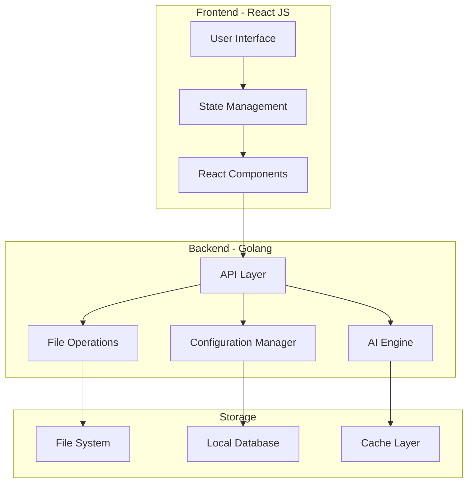

# Technical Requirements Document
# PhotoSort Desktop Application

**Version:** 1.0  
**Date:** February 2, 2026  
**Status:** Draft

---

## 1. System Architecture

### 1.1 High-Level Architecture



### 1.2 Technology Stack

#### Frontend
- **Framework:** React JS 18+
- **State Management:** Zustand atau Redux Toolkit
- **UI Components:** 
  - Custom components dengan CSS modules
  - React Window (virtual scrolling)
  - React DnD (drag & drop)
- **Build Tool:** Vite
- **Styling:** CSS Modules + CSS Variables

#### Backend
- **Language:** Golang 1.21+
- **Desktop Framework:** Wails v2
- **Key Libraries:**
  - `goimagehash` - Perceptual hashing
  - `goexif` - EXIF data extraction
  - `fsnotify` - File system watching
  - `bbolt` - Embedded database
  - `go-sqlite3` - Alternative database

#### Desktop Packaging
- **Primary:** Wails (Go + React native desktop)
- **Benefits:**
  - Native performance
  - Small binary size (~10-20MB)
  - No Chromium overhead
  - Native OS integration

---

## 2. Functional Requirements

### 2.1 File Scanning Module

#### FR-SCAN-001: Folder Selection
- **Description:** User dapat memilih folder untuk di-scan
- **Input:** Folder path via file dialog
- **Output:** List of files dengan metadata
- **Constraints:** 
  - Max 3000 files per scan
  - Warning jika > 3000 files
  - Support nested folders (optional)

#### FR-SCAN-002: File Type Filtering
- **Description:** Filter files berdasarkan extension
- **Supported Types:** See PRD Section 5.1
- **Output:** Filtered file list
- **Performance:** < 10 seconds untuk 3000 files

#### FR-SCAN-003: Metadata Extraction
- **Description:** Extract metadata dari setiap file
- **Metadata:**
  - File name
  - File size
  - Creation date
  - Modification date
  - EXIF data (untuk images)
  - Thumbnail (untuk images/videos)
- **Performance:** Parallel processing, max 10 seconds

---

### 2.2 AI Grouping Module

#### FR-AI-001: Visual Similarity Detection
- **Algorithm:** Perceptual Hashing (pHash)
- **Process:**
  1. Generate pHash untuk setiap image
  2. Compare hashes dengan Hamming distance
  3. Group images dengan similarity > threshold
- **Threshold:** Configurable (default: 80%)
- **Performance:** < 30 seconds untuk 3000 images

#### FR-AI-002: Temporal Grouping
- **Input:** File timestamps (EXIF atau file system)
- **Grouping Options:**
  - Same hour
  - Same day (default)
  - Same week
  - Custom range (X hours/days)
- **Output:** Groups dengan timestamp ranges

#### FR-AI-003: Hybrid Grouping
- **Description:** Combine visual + temporal grouping
- **Logic:**
  - First group by time
  - Then apply visual similarity within time groups
- **Output:** Optimized groups

---

### 2.3 File Operations Module

#### FR-FO-001: Move Files
- **Description:** Move file(s) dari source ke destination folder
- **Safety:**
  - Check destination exists
  - Handle name conflicts (rename, skip, overwrite)
  - Atomic operations (rollback on failure)
- **Performance:** Batch operations dengan progress

#### FR-FO-002: Copy Files
- **Description:** Copy file(s) (optional feature)
- **Use Case:** User ingin keep original
- **Implementation:** Same as move, but copy instead

#### FR-FO-003: Delete Files
- **Description:** Delete file(s) safely
- **Safety:**
  - Move to recycle bin (not permanent delete)
  - Confirmation dialog
  - Undo capability
- **Constraints:** Windows recycle bin integration

#### FR-FO-004: Rename Files
- **Description:** Rename single atau batch files
- **Features:**
  - Inline editing
  - Pattern-based batch rename
  - Conflict detection
- **Validation:** No invalid characters, no duplicates

---

### 2.4 Folder Management Module

#### FR-FM-001: Create Folder
- **Description:** Create new folder dalam destination
- **Input:** Folder name
- **Validation:** 
  - No invalid characters
  - No duplicate names
  - Max length 255 chars
- **Output:** New folder created

#### FR-FM-002: Rename Folder
- **Description:** Rename existing folder
- **Features:**
  - Inline editing
  - Validation
  - Update references
- **Safety:** Check if folder contains files

#### FR-FM-003: Delete Folder
- **Description:** Delete folder
- **Safety:**
  - Confirmation if contains files
  - Move to recycle bin
  - Undo capability

#### FR-FM-004: Folder Statistics
- **Description:** Show folder info
- **Data:**
  - Number of files
  - Total size
  - File types breakdown
- **Update:** Real-time

---

### 2.5 Keyboard Shortcuts Module

#### FR-KS-001: Default Shortcuts
- **Description:** Pre-defined shortcuts
- **List:** See PRD Section 5.4
- **Implementation:** Global keyboard listener

#### FR-KS-002: Custom Shortcuts
- **Description:** User dapat customize shortcuts
- **Features:**
  - Visual editor
  - Conflict detection
  - Reset to default
- **Storage:** Save to config file

#### FR-KS-003: Shortcut Profiles
- **Description:** Save/load shortcut configurations
- **Format:** JSON file
- **Features:**
  - Export profile
  - Import profile
  - Multiple profiles

---

### 2.6 UI/UX Module

#### FR-UI-001: File Grid View
- **Description:** Display files dalam grid
- **Features:**
  - Virtual scrolling (react-window)
  - Thumbnail preview
  - Multi-select
  - Drag & drop
- **Performance:** Smooth 60fps scrolling

#### FR-UI-002: File List View
- **Description:** Alternative list view
- **Features:**
  - Sortable columns
  - Detailed metadata
  - Multi-select
- **Toggle:** Switch between grid/list

#### FR-UI-003: Folder Sidebar
- **Description:** Sidebar dengan folder list
- **Features:**
  - Collapsible
  - Drag & drop target
  - Folder statistics
  - Color coding

#### FR-UI-004: Preview Panel
- **Description:** Preview selected file
- **Support:**
  - Images (full resolution)
  - Videos (playback)
  - Audio (playback)
  - Documents (basic preview)
- **Shortcut:** Space bar

#### FR-UI-005: Progress Indicators
- **Description:** Show progress untuk long operations
- **Types:**
  - Scanning progress
  - AI grouping progress
  - File operation progress
- **Features:** Cancellable operations

---

### 2.7 Configuration Module

#### FR-CFG-001: Settings Panel
- **Description:** UI untuk configure app
- **Categories:**
  - General (theme, language)
  - AI Settings (thresholds)
  - Shortcuts
  - Performance
- **Storage:** Config file (JSON/TOML)

#### FR-CFG-002: Project Save/Load
- **Description:** Save current session state
- **Data:**
  - Source folder
  - Destination folders
  - File groupings
  - Shortcuts
  - AI settings
- **Format:** JSON file
- **Auto-save:** Every 5 minutes

---

## 3. Non-Functional Requirements

### 3.1 Performance Requirements

#### NFR-PERF-001: Startup Time
- **Requirement:** App startup < 3 seconds
- **Measurement:** Time from launch to UI ready
- **Target:** Cold start < 3s, warm start < 1s

#### NFR-PERF-002: File Scanning
- **Requirement:** Scan 3000 files < 10 seconds
- **Measurement:** Time from scan start to results displayed
- **Optimization:**
  - Parallel processing
  - Lazy thumbnail generation
  - Caching

#### NFR-PERF-003: AI Grouping
- **Requirement:** Group 3000 files < 30 seconds
- **Measurement:** Time from AI start to groups ready
- **Optimization:**
  - Parallel hash generation
  - Efficient similarity comparison
  - Progress updates

#### NFR-PERF-004: UI Responsiveness
- **Requirement:** 60fps scrolling, < 100ms interaction response
- **Measurement:** Frame rate, input lag
- **Optimization:**
  - Virtual scrolling
  - Debounced operations
  - Web workers untuk heavy tasks

#### NFR-PERF-005: Memory Usage
- **Requirement:** < 500MB RAM untuk 3000 files
- **Measurement:** Peak memory usage
- **Optimization:**
  - Lazy loading
  - Thumbnail caching with LRU
  - Garbage collection tuning

---

### 3.2 Reliability Requirements

#### NFR-REL-001: Data Integrity
- **Requirement:** Zero data loss during operations
- **Implementation:**
  - Atomic file operations
  - Transaction-like behavior
  - Rollback on failure
- **Testing:** Stress test dengan 10,000 operations

#### NFR-REL-002: Error Handling
- **Requirement:** Graceful error handling
- **Implementation:**
  - Try-catch all file operations
  - User-friendly error messages
  - Logging untuk debugging
- **Coverage:** 100% error paths tested

#### NFR-REL-003: Crash Recovery
- **Requirement:** Auto-recovery dari crashes
- **Implementation:**
  - Auto-save state
  - Restore last session on startup
  - Corrupted state detection
- **Testing:** Forced crash scenarios

#### NFR-REL-004: Undo/Redo
- **Requirement:** Undo last 10 operations
- **Implementation:**
  - Command pattern
  - Operation history stack
  - Reversible operations
- **Limitation:** File deletes (recycle bin)

---

### 3.3 Usability Requirements

#### NFR-USE-001: Learning Curve
- **Requirement:** User dapat sort 1000 files dalam first session
- **Implementation:**
  - Intuitive UI
  - Tooltips
  - Onboarding tutorial (optional)
- **Measurement:** User testing

#### NFR-USE-002: Keyboard-First
- **Requirement:** Semua actions accessible via keyboard
- **Implementation:**
  - Comprehensive shortcuts
  - Focus management
  - Visual shortcut hints
- **Testing:** Navigate entire app without mouse

#### NFR-USE-003: Visual Feedback
- **Requirement:** Clear feedback untuk setiap action
- **Implementation:**
  - Loading states
  - Success/error notifications
  - Hover effects
  - Selection highlights
- **Standard:** Material Design principles

---

### 3.4 Compatibility Requirements

#### NFR-COMP-001: Windows Version
- **Requirement:** Support Windows 10 dan 11
- **Testing:** Test pada kedua OS versions
- **Minimum:** Windows 10 version 1809

#### NFR-COMP-002: File System
- **Requirement:** Support NTFS, FAT32, exFAT
- **Testing:** Test pada berbagai file systems
- **Limitation:** Network drives (best effort)

#### NFR-COMP-003: Screen Resolution
- **Requirement:** Support 1366x768 hingga 4K
- **Implementation:** Responsive design
- **Testing:** Test pada berbagai resolutions

---

### 3.5 Security Requirements

#### NFR-SEC-001: File Access
- **Requirement:** Only access user-selected folders
- **Implementation:** No background scanning
- **Privacy:** No telemetry, no network access

#### NFR-SEC-002: Safe Operations
- **Requirement:** Prevent accidental data loss
- **Implementation:**
  - Confirmation dialogs
  - Recycle bin integration
  - Undo functionality
- **Testing:** User testing dengan destructive operations

---

### 3.6 Maintainability Requirements

#### NFR-MAIN-001: Code Quality
- **Requirement:** Maintainable, documented code
- **Standards:**
  - Go: `gofmt`, `golint`
  - React: ESLint, Prettier
  - Test coverage > 70%
- **Documentation:** Inline comments, README

#### NFR-MAIN-002: Logging
- **Requirement:** Comprehensive logging
- **Levels:** Debug, Info, Warning, Error
- **Storage:** Log files dengan rotation
- **Privacy:** No sensitive data logged

#### NFR-MAIN-003: Modularity
- **Requirement:** Modular architecture
- **Benefits:**
  - Easy to add features
  - Easy to test
  - Easy to refactor
- **Pattern:** Clean architecture, dependency injection

---

## 4. Data Requirements

### 4.1 Data Models

#### File Model
```go
type File struct {
    ID           string    // Unique identifier
    Path         string    // Full file path
    Name         string    // File name
    Extension    string    // File extension
    Size         int64     // File size in bytes
    CreatedAt    time.Time // Creation timestamp
    ModifiedAt   time.Time // Modification timestamp
    Hash         string    // Perceptual hash (for images)
    ThumbnailURL string    // Thumbnail path
    GroupID      string    // Group identifier
    Metadata     map[string]interface{} // EXIF, etc.
}
```

#### Folder Model
```go
type Folder struct {
    ID        string    // Unique identifier
    Name      string    // Folder name
    Path      string    // Full folder path
    Color     string    // Color code (optional)
    Shortcut  string    // Keyboard shortcut
    FileCount int       // Number of files
    TotalSize int64     // Total size in bytes
    CreatedAt time.Time // Creation timestamp
}
```

#### Group Model
```go
type Group struct {
    ID          string    // Unique identifier
    Name        string    // Group name (auto or user-defined)
    Type        string    // "visual", "temporal", "hybrid"
    Files       []File    // Files in group
    Similarity  float64   // Average similarity score
    TimeRange   TimeRange // Time range (for temporal groups)
    FolderID    string    // Assigned folder (optional)
}
```

#### Project Model
```go
type Project struct {
    ID            string    // Unique identifier
    Name          string    // Project name
    SourcePath    string    // Source folder path
    DestPath      string    // Destination folder path
    Folders       []Folder  // Created folders
    Groups        []Group   // AI groups
    Settings      Settings  // AI settings, shortcuts, etc.
    LastSaved     time.Time // Last save timestamp
}
```

### 4.2 Storage

#### Local Database
- **Technology:** BoltDB atau SQLite
- **Purpose:** 
  - Store project data
  - Cache file metadata
  - Store configuration
- **Size:** < 100MB untuk 3000 files

#### File System
- **Purpose:** 
  - Thumbnails cache
  - Log files
  - Config files
- **Location:** `%APPDATA%/PhotoSort/`

#### Cache Strategy
- **Thumbnails:** LRU cache, max 500MB
- **File Metadata:** In-memory cache dengan persistence
- **Invalidation:** On file system changes

---

## 5. API Specifications

### 5.1 Backend API (Golang → React)

#### Scan API
```go
// ScanFolder scans a folder and returns file list
func ScanFolder(path string, filters FileFilters) ([]File, error)

// GetFileMetadata extracts metadata from a file
func GetFileMetadata(path string) (Metadata, error)

// GenerateThumbnail creates thumbnail for a file
func GenerateThumbnail(path string, size int) (string, error)
```

#### AI API
```go
// GroupByVisualSimilarity groups files by visual similarity
func GroupByVisualSimilarity(files []File, threshold float64) ([]Group, error)

// GroupByTime groups files by timestamp
func GroupByTime(files []File, timeRange TimeRange) ([]Group, error)

// HybridGrouping combines visual and temporal grouping
func HybridGrouping(files []File, config GroupConfig) ([]Group, error)
```

#### File Operations API
```go
// MoveFiles moves files to destination
func MoveFiles(files []File, destFolder string) error

// CopyFiles copies files to destination
func CopyFiles(files []File, destFolder string) error

// DeleteFiles deletes files (to recycle bin)
func DeleteFiles(files []File) error

// RenameFile renames a file
func RenameFile(file File, newName string) error
```

#### Folder Operations API
```go
// CreateFolder creates a new folder
func CreateFolder(path string, name string) (Folder, error)

// RenameFolder renames a folder
func RenameFolder(folder Folder, newName string) error

// DeleteFolder deletes a folder
func DeleteFolder(folder Folder) error

// GetFolderStats returns folder statistics
func GetFolderStats(folder Folder) (FolderStats, error)
```

#### Project API
```go
// SaveProject saves current project state
func SaveProject(project Project) error

// LoadProject loads a project
func LoadProject(projectID string) (Project, error)

// AutoSave auto-saves project
func AutoSave(project Project) error
```

### 5.2 Event System

#### Events (Backend → Frontend)
```typescript
// File scanning events
onScanProgress(progress: number, current: string)
onScanComplete(files: File[])
onScanError(error: Error)

// AI grouping events
onGroupingProgress(progress: number)
onGroupingComplete(groups: Group[])
onGroupingError(error: Error)

// File operation events
onFileOperationProgress(progress: number)
onFileOperationComplete()
onFileOperationError(error: Error)

// File system events
onFileSystemChange(change: FileSystemChange)
```

---

## 6. UI/UX Specifications

### 6.1 Component Hierarchy

```
App
├── TitleBar
├── MenuBar
├── Toolbar
│   ├── ScanButton
│   ├── AIGroupButton
│   ├── SettingsButton
│   └── SearchBox
├── MainLayout
│   ├── FolderSidebar
│   │   ├── FolderList
│   │   └── NewFolderButton
│   ├── FileGrid (or FileList)
│   │   ├── VirtualScroll
│   │   └── FileItem[]
│   └── PreviewPanel (optional)
└── StatusBar
    ├── SelectionInfo
    ├── TotalInfo
    └── ProgressIndicator
```

### 6.2 State Management

#### Global State (Zustand/Redux)
```typescript
interface AppState {
  // Files
  files: File[]
  selectedFiles: string[] // File IDs
  
  // Folders
  folders: Folder[]
  activeFolderID: string
  
  // Groups
  groups: Group[]
  
  // UI State
  viewMode: 'grid' | 'list'
  sortBy: 'name' | 'date' | 'size'
  filterBy: FileFilter
  
  // Operations
  isScanning: boolean
  isGrouping: boolean
  operationProgress: number
  
  // Settings
  settings: Settings
  shortcuts: Shortcut[]
  
  // Project
  currentProject: Project
  isDirty: boolean // Unsaved changes
}
```

### 6.3 Responsive Design

#### Breakpoints
- **Small:** 1366x768 (minimum)
- **Medium:** 1920x1080 (common)
- **Large:** 2560x1440 (2K)
- **XLarge:** 3840x2160 (4K)

#### Adaptive Layout
- **Small:** Single column, collapsible sidebar
- **Medium+:** Two column, persistent sidebar
- **Large+:** Three column dengan preview panel

---

## 7. Testing Requirements

### 7.1 Unit Testing
- **Coverage:** > 70%
- **Framework:** 
  - Go: `testing` package
  - React: Jest + React Testing Library
- **Focus:** Business logic, utilities

### 7.2 Integration Testing
- **Scope:** API integration, file operations
- **Framework:** Go integration tests
- **Environment:** Test folders dengan sample files

### 7.3 E2E Testing
- **Scope:** Complete user workflows
- **Framework:** Playwright atau Wails testing tools
- **Scenarios:**
  - Scan → Group → Sort → Save
  - Keyboard-only workflow
  - Error scenarios

### 7.4 Performance Testing
- **Load Testing:** 3000 files, 10,000 files
- **Stress Testing:** Low memory, slow disk
- **Profiling:** CPU, memory, disk I/O

### 7.5 User Testing
- **Participants:** 5-10 target users
- **Tasks:** Complete sorting workflow
- **Metrics:** Time to complete, errors, satisfaction

---

## 8. Deployment Requirements

### 8.1 Build Process
```bash
# Development build
wails dev

# Production build
wails build -clean -platform windows/amd64

# Output: PhotoSort.exe (~15-25MB)
```

### 8.2 Installation
- **Installer:** NSIS atau Wix
- **Install Location:** `C:\Program Files\PhotoSort\`
- **User Data:** `%APPDATA%\PhotoSort\`
- **Shortcuts:** Desktop, Start Menu

### 8.3 Updates
- **Mechanism:** Auto-update (optional)
- **Check:** On startup (non-blocking)
- **Download:** Background download
- **Install:** On next restart

---

## 9. Development Timeline

### Phase 1: Foundation (Week 1-2)
- [ ] Setup Wails project
- [ ] Basic UI layout (React)
- [ ] File scanning module (Go)
- [ ] File grid view dengan virtual scrolling

### Phase 2: Core Features (Week 3-4)
- [ ] Folder management
- [ ] File operations (move, delete)
- [ ] Keyboard shortcuts
- [ ] Drag & drop

### Phase 3: AI Integration (Week 5-6)
- [ ] Perceptual hashing implementation
- [ ] Visual similarity grouping
- [ ] Temporal grouping
- [ ] AI settings panel

### Phase 4: Polish (Week 7-8)
- [ ] Project save/load
- [ ] Auto-save
- [ ] Undo/redo
- [ ] Error handling
- [ ] Performance optimization

### Phase 5: Testing & Release (Week 9-10)
- [ ] Unit tests
- [ ] Integration tests
- [ ] User testing
- [ ] Bug fixes
- [ ] Documentation
- [ ] Release build

---

## 10. Dependencies

### 10.1 Golang Dependencies
```go
require (
    github.com/wailsapp/wails/v2 v2.x.x
    github.com/corona10/goimagehash v1.x.x
    github.com/rwcarlsen/goexif v0.0.0
    github.com/fsnotify/fsnotify v1.x.x
    go.etcd.io/bbolt v1.x.x
    github.com/disintegration/imaging v1.x.x
)
```

### 10.2 React Dependencies
```json
{
  "dependencies": {
    "react": "^18.2.0",
    "react-dom": "^18.2.0",
    "zustand": "^4.x.x",
    "react-window": "^1.x.x",
    "react-dnd": "^16.x.x"
  },
  "devDependencies": {
    "vite": "^5.x.x",
    "typescript": "^5.x.x",
    "@types/react": "^18.x.x",
    "eslint": "^8.x.x",
    "prettier": "^3.x.x"
  }
}
```

---

## 11. Risks & Mitigation

| Risk | Probability | Impact | Mitigation |
|------|-------------|--------|------------|
| AI accuracy insufficient | Medium | High | Fallback to manual, allow threshold tuning |
| Performance issues with large files | Medium | High | Virtual scrolling, lazy loading, caching |
| Wails learning curve | Low | Medium | Follow official docs, community support |
| File operation errors | Medium | High | Robust error handling, undo system |
| Cross-platform issues | Low | Low | Focus Windows first, extensive testing |

---

## 12. Glossary

- **pHash:** Perceptual Hash - algorithm untuk detect visual similarity
- **EXIF:** Exchangeable Image File Format - metadata dalam photos
- **Virtual Scrolling:** Technique untuk render only visible items
- **LRU Cache:** Least Recently Used cache eviction strategy
- **Atomic Operation:** Operation yang complete fully atau not at all

---

## 13. References

- [Wails Documentation](https://wails.io/docs/introduction)
- [goimagehash Library](https://github.com/corona10/goimagehash)
- [React Window](https://react-window.vercel.app/)
- [Perceptual Hashing](http://www.hackerfactor.com/blog/index.php?/archives/432-Looks-Like-It.html)

---

**Document Approval:**

| Role | Name | Date |
|------|------|------|
| Tech Lead | - | - |
| Backend Engineer | - | - |
| Frontend Engineer | - | - |

